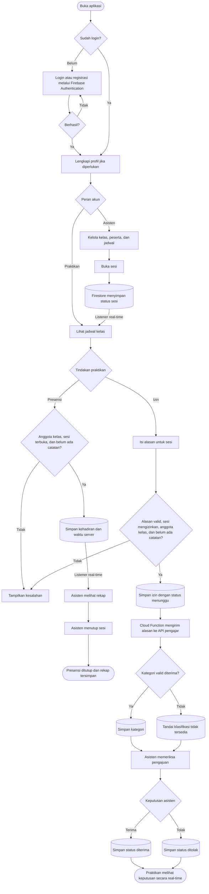

# Flowchart Sprint 2

```mermaid
flowchart TD
  Mulai([Buka aplikasi]) --> Auth{Sudah login?}
  Auth -- Belum --> Login[Login atau registrasi melalui Firebase Authentication]
  Login --> Valid{Berhasil?}
  Valid -- Tidak --> Login
  Valid -- Ya --> Profil
  Auth -- Ya --> Profil[Lengkapi profil jika diperlukan]
  Profil --> Peran{Peran akun}
  Peran -- Asisten --> Kelola[Kelola kelas, peserta, dan jadwal]
  Kelola --> Buka[Buka sesi]
  Buka --> Status[(Firestore menyimpan status sesi)]
  Peran -- Praktikan --> Jadwal[Lihat jadwal kelas]
  Status -->|Listener real-time| Jadwal
  Jadwal --> Pilih{Tindakan praktikan}
  Pilih -- Presensi --> Cek{Anggota kelas, sesi terbuka, dan belum ada catatan?}
  Cek -- Tidak --> Tolak[Tampilkan kesalahan]
  Cek -- Ya --> Hadir[(Simpan kehadiran dan waktu server)]
  Hadir -->|Listener real-time| Rekap[Asisten melihat rekap]
  Rekap --> Tutup[Asisten menutup sesi]
  Tutup --> Akhir([Presensi ditutup dan rekap tersimpan])
  Pilih -- Izin --> Alasan[Isi alasan untuk sesi]
  Alasan --> IzinValid{Alasan valid, sesi mengizinkan, anggota kelas, dan belum ada catatan?}
  IzinValid -- Tidak --> Tolak
  IzinValid -- Ya --> Simpan[(Simpan izin dengan status menunggu)]
  Simpan --> API[Cloud Function mengirim alasan ke API pengajar]
  API --> Hasil{Kategori valid diterima?}
  Hasil -- Ya --> Kategori[(Simpan kategori)]
  Hasil -- Tidak --> Gagal[(Tandai klasifikasi tidak tersedia)]
  Kategori --> Ulas[Asisten memeriksa pengajuan]
  Gagal --> Ulas
  Ulas --> Putus{Keputusan asisten}
  Putus -- Terima --> Terima[(Simpan status diterima)]
  Putus -- Tolak --> Ditolak[(Simpan status ditolak)]
  Terima --> Pantau([Praktikan melihat keputusan secara real-time])
  Ditolak --> Pantau
```
